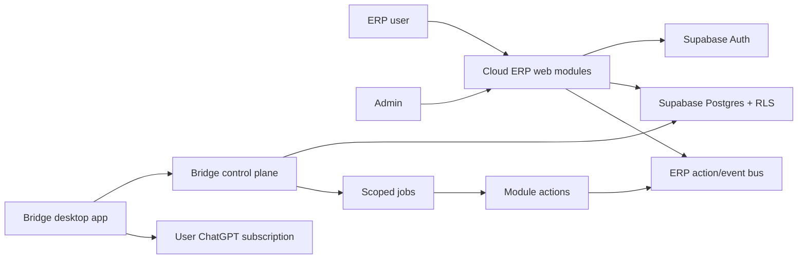

# yaka-bridge

[](LICENSE)
[](package.json)
[](.github/workflows/ci.yml)

yaka-bridge is a production-oriented template for building modular cloud ERP
systems that work with a local Bridge desktop app, Supabase, MCP-compatible
agentic workflows and each collaborator's ChatGPT subscription.

It is designed for teams that want business software where humans, web modules,
local tools and ChatGPT collaborate through explicit actions, scopes,
entitlements and audit logs.

## Why this exists

Most ERP projects become hard to evolve because each customer implementation
mixes product code, private configuration, domain-specific data and automation
shortcuts. yaka-bridge separates those concerns:

- the public template contains reusable structure, modules and production
  guardrails;
- private customer repositories contain real domains, data, secrets and
  customer-specific overrides;
- every useful customer module can later be anonymized and promoted back into
  the template;
- Bridge executes local or ChatGPT-assisted jobs only through scoped,
  revocable, auditable access.

The economic idea is to use existing ChatGPT subscriptions for agentic work
where appropriate, instead of turning every workflow into metered API calls.
OpenAI bills API usage separately from ChatGPT subscriptions, so any ROI claim
must be recalculated against official OpenAI pricing and real customer volumes:

- https://openai.com/chatgpt/pricing/
- https://openai.com/api/pricing/

## Project status

This repository is a public template. It is not a hosted demo and it does not
contain real customer data.

Current catalog module:

- `purchasing` / `Achats`: suppliers, quotes, comparison workflows, demo seeds,
  agentic actions and RLS-protected Supabase tables.

Current production posture:

- Supabase-backed organizations, memberships, services and entitlements.
- Strict cloud authZ with organization membership, roles and scopes.
- Signed, expiring, revocable Bridge tokens.
- Module manifests, migrations and demo seeds.
- CI checks for typecheck, build, tests, audit, secret/client-name grep and
  deterministic factory generation.

## Table of contents

- [Architecture](#architecture)
- [Repository layout](#repository-layout)
- [Quick start](#quick-start)
- [Generate a demo ERP](#generate-a-demo-erp)
- [Create a new module](#create-a-new-module)
- [Create a new client/VPS](#create-a-new-clientvps)
- [Security model](#security-model)
- [Production checklist](#production-checklist)
- [Documentation](#documentation)
- [Contributing](#contributing)
- [License](#license)

## Architecture



Core concepts:

- **ERP modules** live under `modules/<moduleId>/` and are described by a
  canonical `module.config.json`.
- **Bridge** is the local installed app. It polls only jobs authorized for its
  organization, device, service and scopes.
- **Actions** are the unit of automation. UI, HTTP routes and MCP tools must use
  the same typed server handlers.
- **Supabase** is the source of authority for auth, roles, scopes, data, jobs
  and audit.
- **Customer repos** are private production implementations derived from this
  template.

## Repository layout

```text
app/                       Next.js App Router pages
bridge/                    Bridge runtime and local job execution
components/                Shared ERP UI components and design system pieces
data-template/             Default runtime data and Claude/Codex context
docs/                      Architecture, security, VPS and factory docs
modules/                   Catalog ERP modules
scripts/                   Factory, build, security and token tooling
server/                    Hono daemon, authZ, actions, MCP and Bridge control plane
skills-template/_global/   Operator skills shipped with generated apps
supabase/migrations/       Supabase schema, RLS and module migrations
tests/security/            Security and contract tests
```

## Quick start

Requirements:

- Node.js `>=24`
- npm
- Git
- Supabase CLI for local database verification
- Docker if running Supabase locally

Install and verify the template:

```bash
npm ci
npm run typecheck
npm test
npm run build
npm audit --audit-level=high
npm run security:grep
```

Start local development:

```bash
npm run dev
```

Local daemon routes require `APP_DAEMON_TOKEN`. `npm run dev` creates a local
development token for the Electron/Next process. Cloud deployments must use
Supabase bearer auth with `REQUIRE_AUTH=1`.

## Generate a demo ERP

Generate an ERP from the module catalog:

```bash
node scripts/new-app-from-brief.mjs \
  --brief briefs/demo-erp-purchasing.md \
  --output-dir ../demo-erp \
  --yes \
  --skip-agents
```

Validate generated output:

```bash
cd ../demo-erp
npm ci
npm run typecheck
npm run build
npm run security:grep
```

The repository CI runs a stricter version through:

```bash
npm run factory:check
```

## Create a new module

Use the shipped operator skill:

```text
Use the yaka-bridge-create-module skill to create a stock management module.
Ask which client it belongs to, then create both the template version and the
client implementation.
```

The skill enforces:

- client target selection;
- English technical id and bilingual UI labels;
- module manifest;
- Supabase tables, migrations, RLS and demo seeds;
- typed server actions;
- UI, HTTP and MCP parity;
- Bridge service, scopes, jobs and entitlements;
- tests for authZ, scopes and entitlement removal.

See [docs/module-catalog.md](docs/module-catalog.md) and
[docs/yaka-bridge-operator-guide.md](docs/yaka-bridge-operator-guide.md).

## Create a new client/VPS

Use the shipped operator skill:

```text
Use the yaka-bridge-new-client-vps skill to create a new customer ERP on a
fresh VPS. Ask me about domain, DNS, modules, backups, Supabase and Bridge.
```

The expected public DNS shape is:

```text
api.<client-domain>              Supabase API / Kong
admin.<client-domain>            ERP administration
erp.<client-domain>              ERP portal
bridge-updates.<client-domain>   Bridge update artifacts
<module>.<client-domain>         module web service
```

See [docs/vps-provisioning-runbook.md](docs/vps-provisioning-runbook.md) and
[docs/supabase-vps-architecture.md](docs/supabase-vps-architecture.md).

## Security model

Security is treated as a product invariant:

- No real customer names, domains, prompts or data in this public template.
- No server fallback from service role key to anon key.
- Cloud private routes require Supabase bearer auth.
- Actions receive server-controlled `ActionContext`, never arbitrary
  client-provided `organizationId`.
- Module data tables include `organization_id` and RLS.
- Bridge tokens are signed, expiring, DB-validated, hash-stored and revocable.
- CORS is allowlist-only in production.
- CI blocks high and critical npm audit findings.

Security reporting is documented in [SECURITY.md](SECURITY.md). Cloud deployment
details are in [docs/cloud-security.md](docs/cloud-security.md).

## Production checklist

Before treating a template or generated ERP change as production-ready:

```bash
npm ci
npm run typecheck
npm test
npm run build
npm audit --audit-level=high
npm run security:grep
npm run factory:check
```

For customer deployments, also verify:

- Supabase migrations apply on a fresh database.
- `/api/*` without bearer returns `401`.
- wrong organization/scope returns `403`.
- `/bridge/*` without token returns `401`.
- expired or revoked Bridge token returns `401`.
- valid Bridge token with wrong service returns `403`.
- entitlement removal hides the module and blocks Bridge jobs.
- DNS, TLS, Supabase redirects, CORS and backups are validated.

## Documentation

Start here:

- [Operator guide](docs/yaka-bridge-operator-guide.md)
- [Architecture](docs/architecture.md)
- [Module catalog](docs/module-catalog.md)
- [Cloud security](docs/cloud-security.md)
- [Client/template workflow](docs/client-template-workflow.md)
- [Bridge multi-services](docs/bridge-multiservices.md)
- [Supabase VPS architecture](docs/supabase-vps-architecture.md)
- [VPS provisioning runbook](docs/vps-provisioning-runbook.md)
- [Factory guide](docs/factory-guide.md)

## Contributing

Contributions are welcome when they preserve the production invariants of the
template. Read [CONTRIBUTING.md](CONTRIBUTING.md) before opening a pull request.

Short version:

- keep the template client-neutral;
- add tests for security-sensitive behavior;
- update docs when architecture or workflows change;
- run the full verification suite before submitting.

## License

MIT. See [LICENSE](LICENSE).
