# Guide d'utilisation OIF-Eval

**Outil d'évaluation des candidatures FAE - Organisation Internationale de la Francophonie**

Ce guide est destiné à l'équipe évaluation OIF qui utilise l'application OIF-Eval pour analyser les dossiers du Fonds "La Francophonie avec Elles" (FAE), toutes éditions confondues. Aucune connaissance technique n'est requise.

L'application repose sur Claude Code (l'IA d'Anthropic) qui propose une grille préremplie pour chaque dossier. Vous validez, ajustez ou complétez. Vos remarques nourrissent les règles utilisées par l'IA pour les dossiers suivants.

---

## Sommaire

1. [Installation](#1-installation)
2. [Premier lancement](#2-premier-lancement)
3. [Évaluer un dossier](#3-evaluer-un-dossier)
4. [Discuter avec Claude](#4-discuter-avec-claude)
5. [Workflow propositions (admin)](#5-workflow-propositions-admin)
6. [Dashboard - suivi de l'équipe (admin)](#6-dashboard-suivi-de-lequipe-admin)
7. [Paramètres](#7-parametres)
8. [Stockage et partage entre évaluateurs](#8-stockage-et-partage-entre-evaluateurs)
9. [Gestion des campagnes (admin)](#9-gestion-des-campagnes-admin)
10. [Calibrage et amélioration des règles (admin)](#10-calibrage-et-amelioration-des-regles-admin)
11. [Conformité et journal d'audit (admin)](#11-conformite-et-journal-daudit-admin)
12. [Aide et support](#12-aide-et-support)

---

## 1. Installation

OIF-Eval est une application de bureau (Mac et Windows) qui s'appuie sur Claude Code, un outil officiel d'Anthropic. L'installation est en trois étapes.

> **Pour copier les commandes sans risque, utilisez le fichier [commandes-installation.txt](commandes-installation.txt) livré à côté de ce PDF.** Il contient toutes les commandes en texte brut, prêtes à être sélectionnées (Cmd+A ou Ctrl+A) et copiées (Cmd+C ou Ctrl+C) dans le terminal.
>
> Les commandes sont aussi affichées ici dans le guide pour la lecture, mais le copier-coller depuis un PDF n'est pas toujours fiable selon le lecteur (Preview macOS notamment coupe parfois le texte au milieu des mots).

### Étape 1 - Installer Claude Code

**Sur Mac**, ouvrir le Terminal (Cmd + Espace, taper "Terminal") et coller :

```bash
curl -fsSL https://claude.ai/install.sh | bash
```

→ Lien direct de l'installeur : [claude.ai/install.sh](https://claude.ai/install.sh)

**Sur Windows**, suivre ces étapes :

**1.** Dans la barre de recherche Windows, taper `powershell` puis cliquer sur "Windows PowerShell".

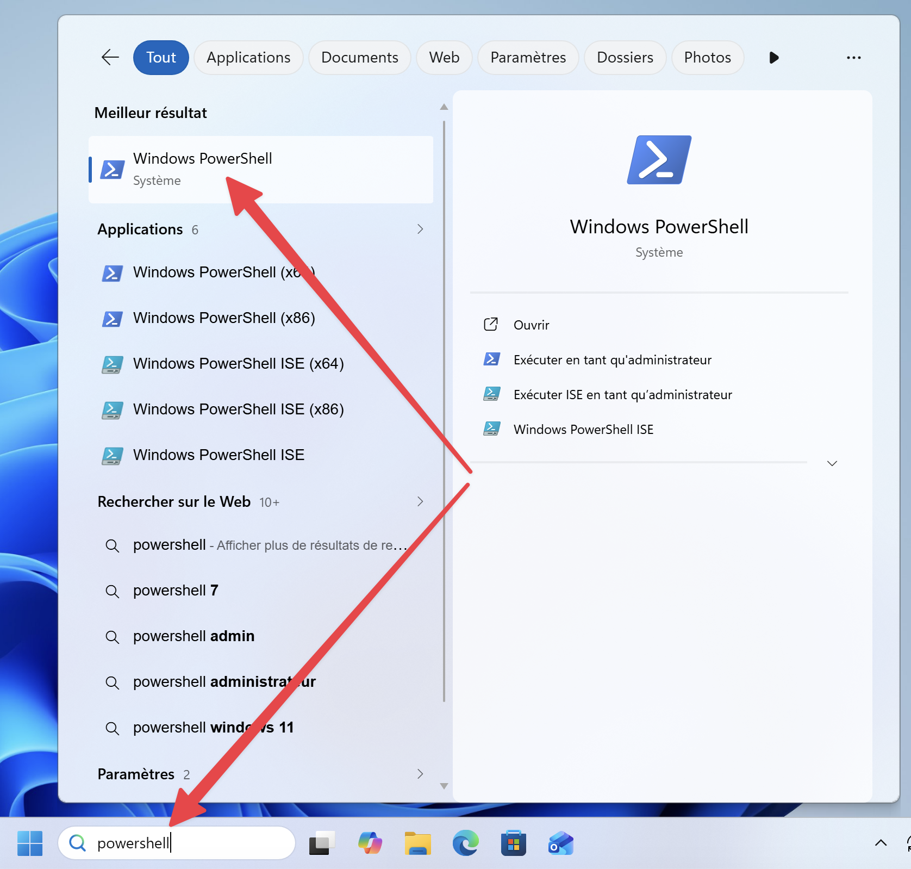

**2.** Dans la fenêtre PowerShell qui s'ouvre, deux options pour installer Claude Code. Choisir l'une **OU** l'autre.

**Option A - Recommandée (mise à jour automatique).** Coller ces trois lignes puis Entrée :

```powershell
irm https://claude.ai/install.ps1 | iex
$bin = "$env:USERPROFILE\.local\bin"; $up = [Environment]::GetEnvironmentVariable("Path", "User")
if (-not $up -or $up -notlike "*$bin*") { [Environment]::SetEnvironmentVariable("Path", ($(if ($up) { "$up;$bin" } else { $bin })), "User") }
$env:Path = [Environment]::GetEnvironmentVariable("Path", "Machine") + ";" + [Environment]::GetEnvironmentVariable("Path", "User")
```

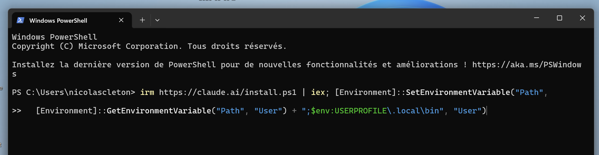

Cette commande télécharge l'installeur officiel d'Anthropic et configure le PATH système. Claude Code se mettra à jour seul à chaque lancement, sans intervention.

**Option B - Via le gestionnaire winget.** Si l'option A échoue ou si vous préférez le gestionnaire de paquets Windows :

```powershell
winget install Anthropic.ClaudeCode
```

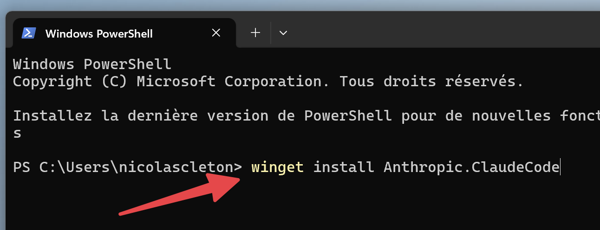

> **À savoir avec winget.** Les mises à jour de Claude Code ne sont pas automatiques. Pensez à lancer `claude update` une fois par mois environ pour récupérer les dernières corrections.

L'installation prend environ 30 secondes dans les deux cas.

### Étape 2 - Se connecter au compte Anthropic de l'OIF

> **Note Mac.** Les captures ci-dessous montrent Windows PowerShell. Sur Mac, la procédure est identique dans le Terminal, l'apparence du shell change mais les invites de Claude Code sont les mêmes.

**3.** Toujours dans PowerShell (ou le Terminal sur Mac), taper `claude` puis Entrée pour lancer l'outil.

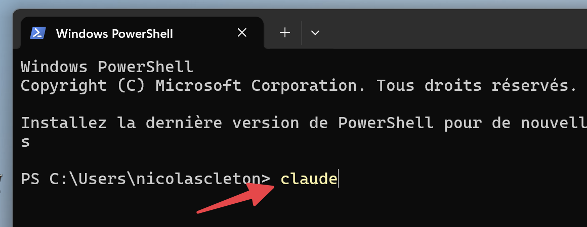

**4.** Au premier lancement, Claude Code propose un thème pour le terminal. Le mode sombre est sélectionné par défaut, valider avec Entrée.

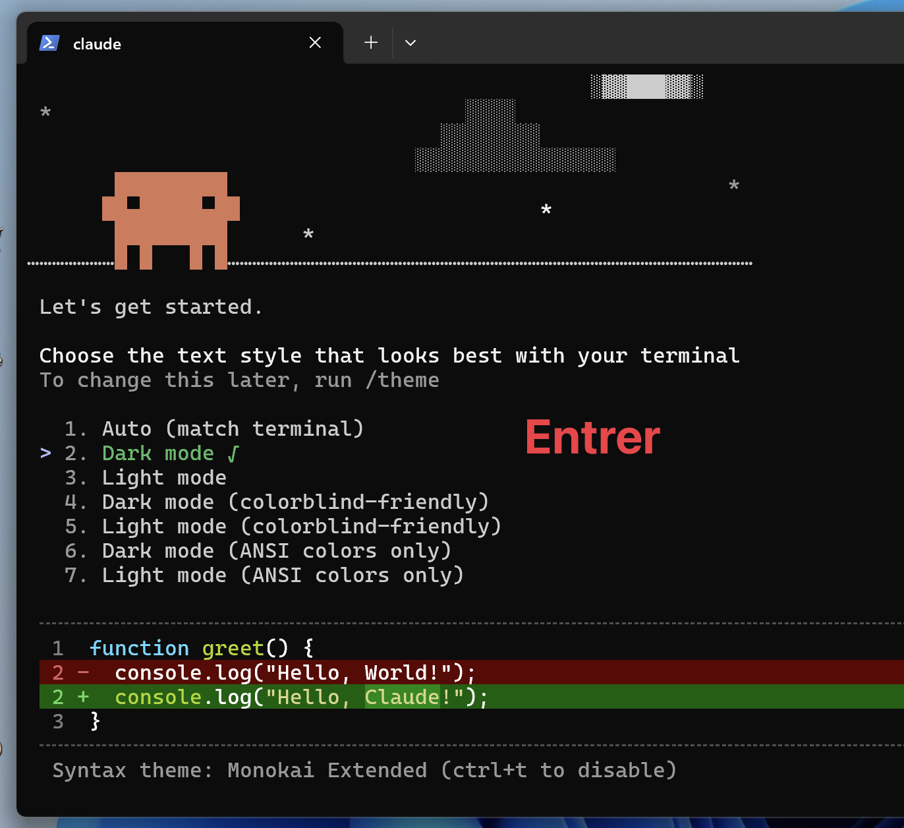

**5.** Choisir la première option, "Claude account with subscription" (compte avec abonnement Pro, Max, Team ou Enterprise) puis Entrée.

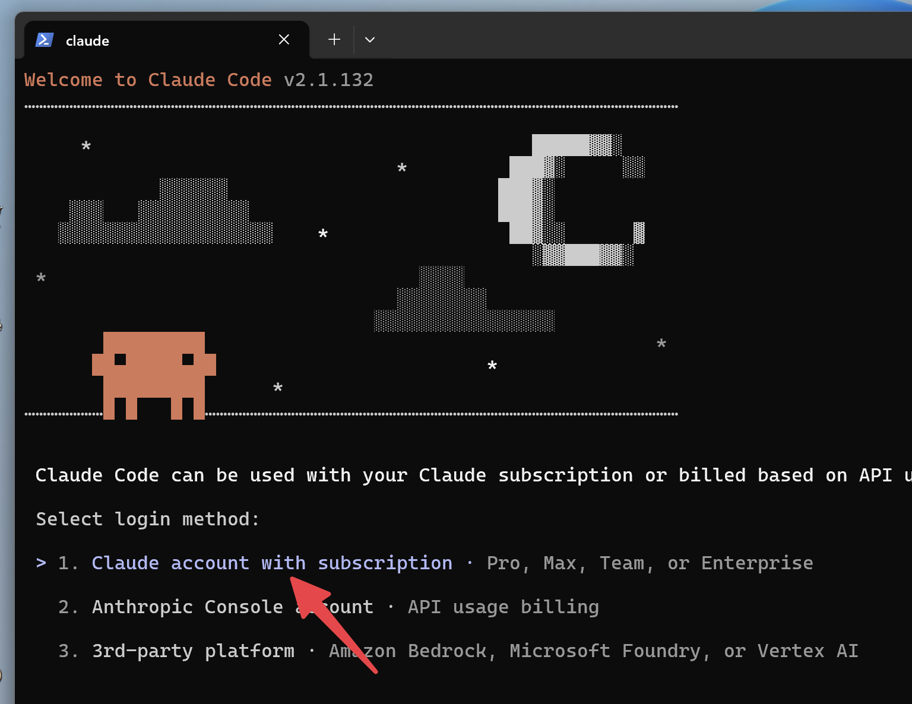

**6.** Un onglet s'ouvre dans le navigateur. Se connecter avec le compte Claude.ai de l'OIF, soit via Google, soit en saisissant l'email.

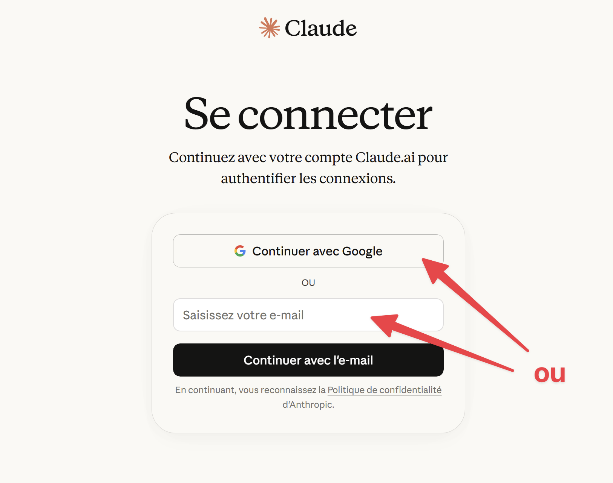

**7.** Cliquer sur "Autoriser" pour permettre à Claude Code d'utiliser votre compte.

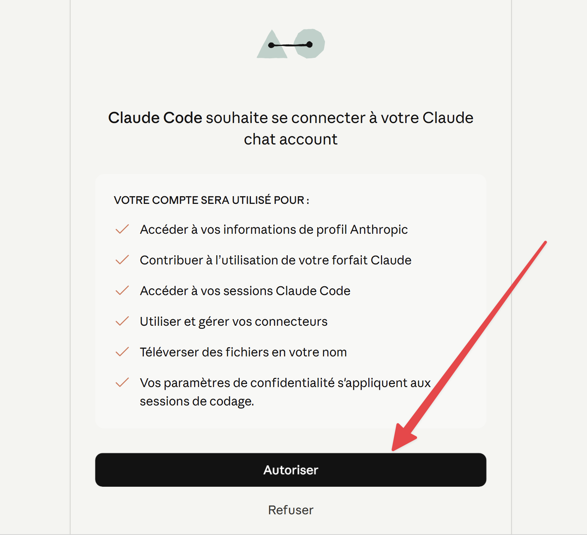

**8.** Le navigateur affiche la confirmation "Tout est prêt pour Claude Code". Vous pouvez fermer cet onglet.

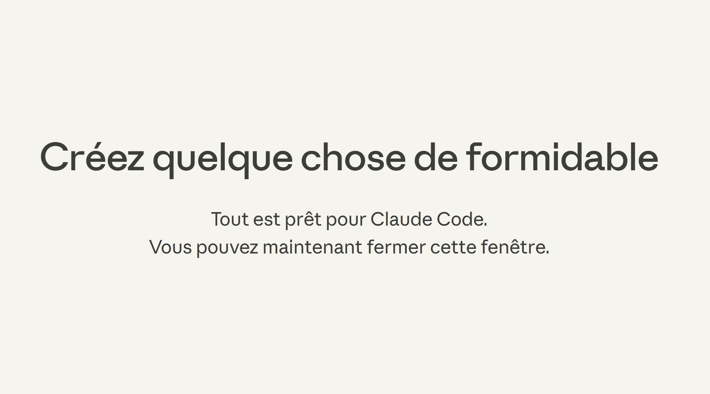

**9.** Revenir dans la fenêtre PowerShell. Le message "Logged in as ..." confirme la connexion. Appuyer sur Entrée pour continuer.

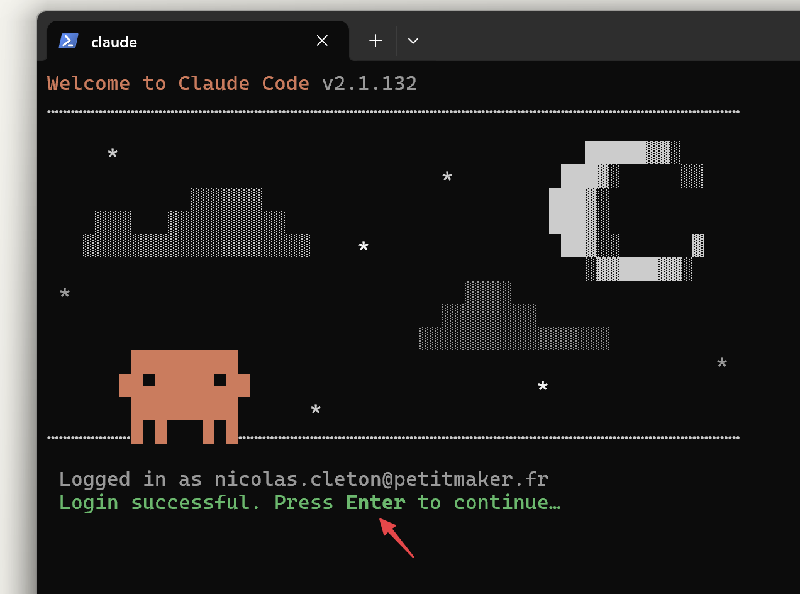

**10.** Claude Code affiche des notes de sécurité importantes. Lire puis appuyer sur Entrée.

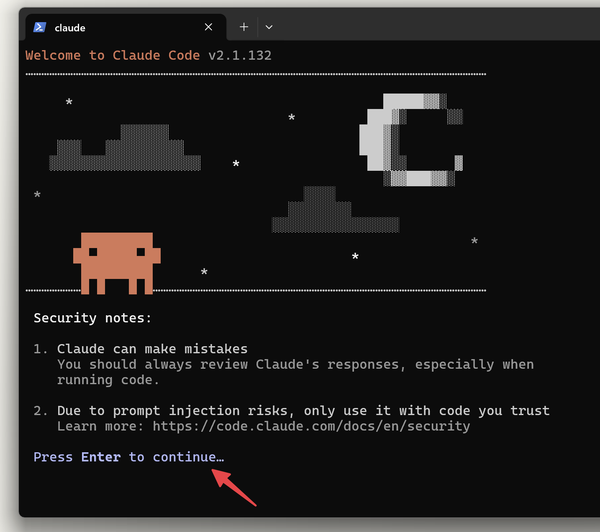

**11.** Enfin, Claude Code demande l'autorisation d'accéder au dossier de travail. Sélectionner "Yes, I trust this folder" et valider avec Entrée.

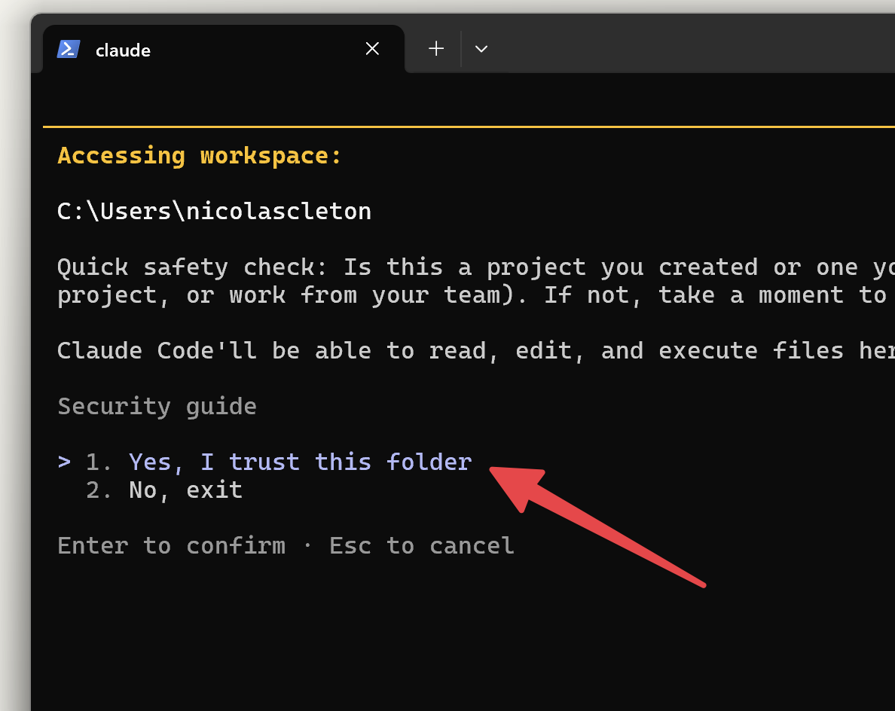

Claude Code est désormais installé et connecté. Vous pouvez fermer la fenêtre PowerShell et lancer OIF-Eval.

### Étape 3 - Installer OIF-Eval

Double-cliquer sur le fichier d'installation reçu :

- **Mac** : `OIF-Eval.dmg`, puis glisser l'icône dans Applications.
- **Windows** : `OIF-Eval-Setup.exe`, suivre l'assistant.

C'est tout. L'application vérifie au démarrage que Claude Code est bien installé. Si ce n'est pas le cas, elle affiche les instructions ci-dessus dans une fenêtre dédiée.

---

## 2. Premier lancement

Au tout premier démarrage, OIF-Eval affiche un petit assistant d'installation en 5 étapes :

1. **Bienvenue** : votre prénom (apparaîtra à côté de vos propositions).
2. **Rôle** : admin ou évaluateur. L'admin peut promouvoir des règles ; l'évaluateur propose et complète.
3. **Dossiers** : choix des emplacements de stockage (candidatures, évaluations, règles partagées).
4. **Campagne** : la campagne FAE active par défaut (7e à l'installation initiale).
5. **Récapitulatif** : tout est modifiable depuis Paramètres.

Une fois passé, vous arrivez sur la page d'accueil :

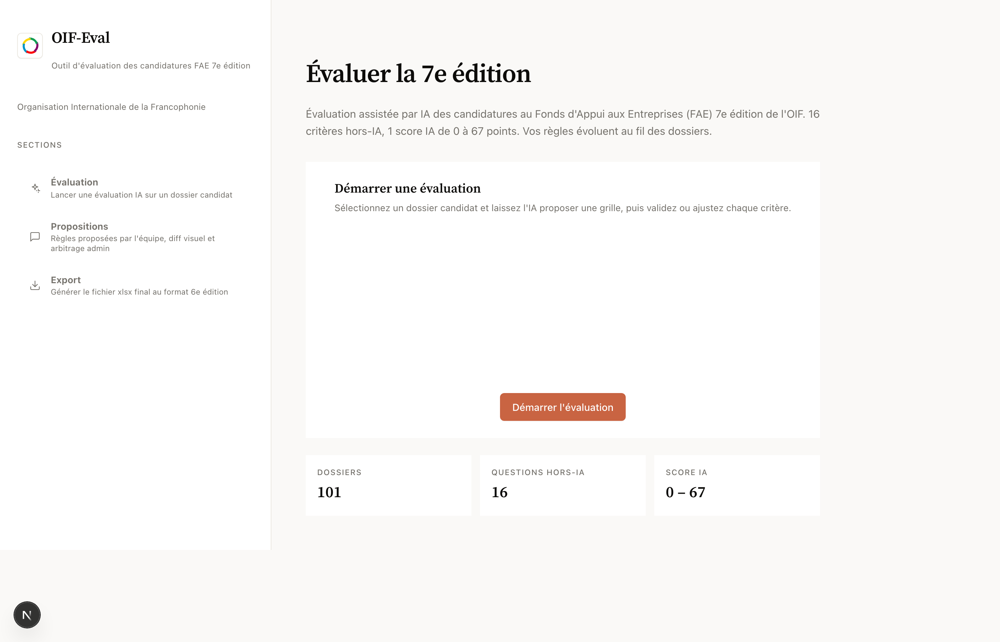

L'écran d'accueil rappelle les trois sections principales : **Évaluation** (analyser les dossiers), **Propositions** (règles proposées par l'équipe) et **Export** (générer le fichier final pour l'OIF).

**Comment faire**

- Cliquer sur "Démarrer l'évaluation" pour passer directement à la page d'analyse.
- Le bouton de navigation à gauche vous emmène à tout moment vers les autres sections.
- Le menu Paramètres reste accessible en haut.

---

## 3. Évaluer un dossier

### 3.1 Choisir un dossier dans la liste

Quand on arrive sur Évaluation, la liste des dossiers s'affiche à gauche, mais aucun dossier n'est encore ouvert :

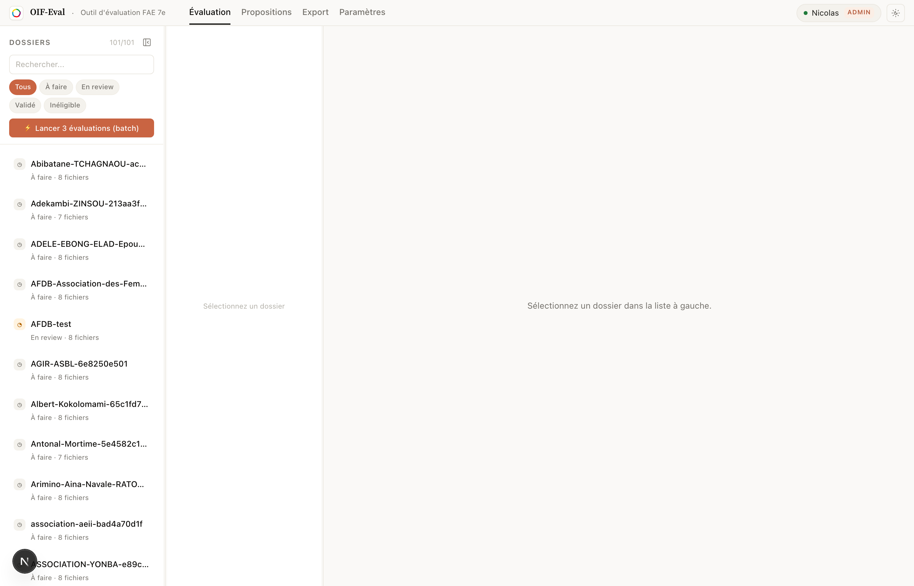

**Comment faire**

- La liste à gauche affiche tous les dossiers candidats trouvés. Un compteur indique combien sont visibles.
- Le champ "Rechercher..." filtre par nom ou identifiant.
- Les filtres par statut (À faire, En review, Validé, Inéligible) limitent l'affichage.
- Le bouton "Lancer 3 évaluations (batch)" permet de lancer plusieurs analyses en parallèle (limite à 3 simultanées, pour éviter de saturer Claude).
- Cliquer sur un dossier pour le sélectionner.

### 3.2 Lire la grille produite par l'IA

Une fois un dossier sélectionné, la grille s'affiche à droite. Elle est divisée en deux parties : l'éligibilité (14 critères) et la notation (49 questions, dont 16 réservées à l'humain).

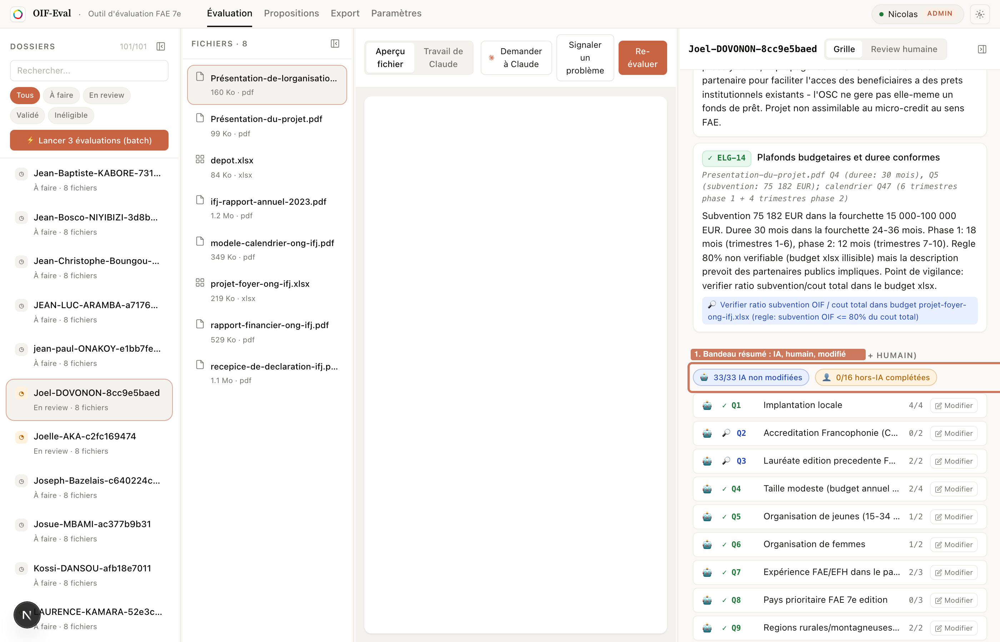

Le bandeau encadré en haut de la grille de notation indique d'un coup d'oeil combien de questions ont été notées par l'IA, combien restent à compléter par un humain et combien ont été modifiées.

**Comment lire les pictogrammes**

- 🤖 = note proposée par Claude.
- 👤 = question réservée à un humain (l'IA ne peut pas la noter, par exemple parce qu'elle nécessite un jugement subjectif).
- ✏️ = note IA modifiée par un humain.
- ✓ vert = question hors-IA déjà complétée par un humain.

**Comment faire**

- Lire la liste des 14 critères d'éligibilité en haut, chaque critère est cité avec sa source (nom du fichier).
- Faire défiler vers le bas pour voir la liste des 49 questions de notation.
- Cliquer sur "Re-évaluer" en haut à droite pour relancer l'analyse de Claude (utile si vous avez modifié des règles entre-temps).
- Le panneau de gauche permet de basculer entre "Aperçu fichier" (lire les PDF du dossier) et "Travail de Claude" (voir le déroulé de l'analyse).

### 3.3 Modifier une note de l'IA

Si vous n'êtes pas d'accord avec une note IA, vous pouvez la corriger sans relancer toute l'évaluation. Cliquez sur "Modifier" à droite d'une question :

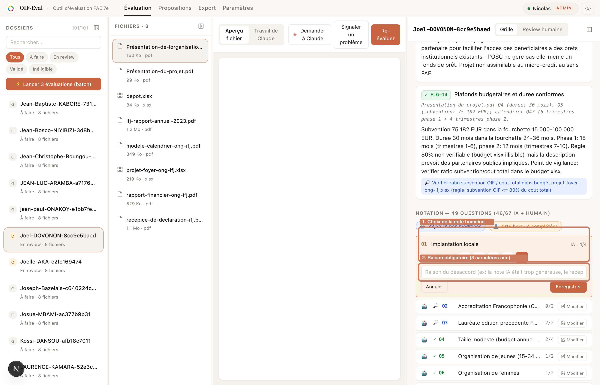

Le mini-formulaire s'ouvre directement dans la grille. Vous choisissez la nouvelle note et expliquez pourquoi.

**Comment faire**

- Cliquer sur l'un des boutons numérotés pour choisir la note humaine (entre 0 et le barème max).
- Saisir une raison (3 caractères minimum). Ex : "le récépissé est valide, l'IA a sous-noté".
- Cliquer "Enregistrer". La note est immédiatement remplacée et reste tracée.
- "Supprimer l'override" permet de revenir à la note IA d'origine.

### 3.4 Compléter une question hors-IA

Les questions marquées 👤 sont réservées à l'humain (16 questions sur 49). Cliquez sur "à compléter" pour basculer en vue Review :

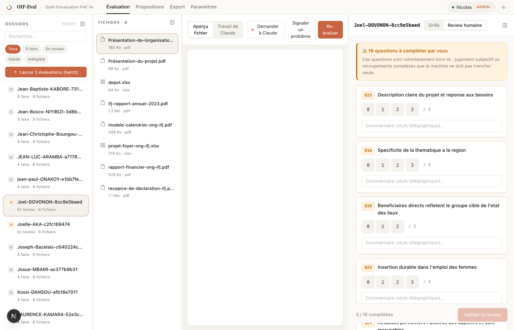

**Comment faire**

- La vue Review affiche toutes les questions hors-IA dans l'ordre.
- Pour chaque question, choisir une note et écrire une justification.
- Le bouton "Valider la review" en bas signe l'évaluation et la marque comme finalisée.
- Vous pouvez basculer entre Grille et Review humaine à tout moment via le sélecteur en haut.

---

## 4. Discuter avec Claude

### 4.1 Poser une question sur le dossier en cours

Si vous avez un doute sur l'analyse de Claude, vous pouvez ouvrir une conversation isolée au dossier :

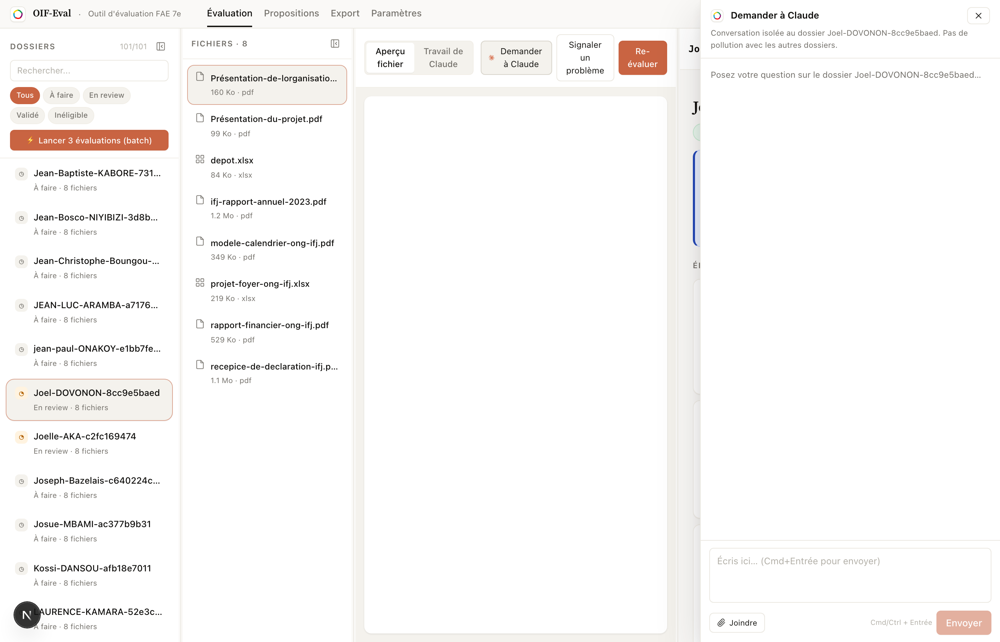

**Comment faire**

- Cliquer sur "Demander à Claude" en haut du panneau central.
- Le drawer s'ouvre sur la droite. La conversation est dédiée à ce dossier (pas de pollution avec les autres).
- Tapez votre question : "Pourquoi avoir mis NON à ELG-3 ?", "Le rapport financier mentionne-t-il un audit ?".
- Claude répond en temps réel et peut consulter les fichiers du dossier.

### 4.2 Signaler un problème et proposer une règle

Quand vous remarquez que Claude se trompe systématiquement, vous pouvez proposer une règle pour corriger le tir sur tous les dossiers à venir :

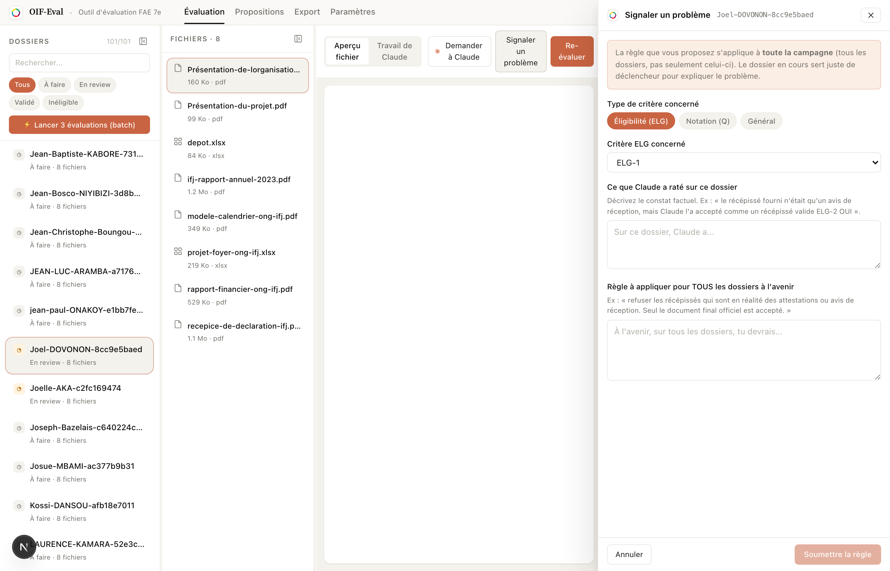

**Comment faire**

- Cliquer sur "Signaler un problème".
- Choisir la phase concernée : Éligibilité, Notation ou Règle générale.
- Indiquer le critère (ELG-2, Q12, etc.).
- Décrire le constat sur ce dossier ("Sur ce dossier, Claude a...").
- Décrire la règle à appliquer ("À l'avenir, sur tous les dossiers, tu devrais...").
- Envoyer. Votre proposition arrive dans la file d'attente de l'admin.

---

## 5. Workflow propositions (admin)

### 5.1 Liste des propositions

La page Propositions liste toutes les règles proposées par l'équipe, avec leur statut :

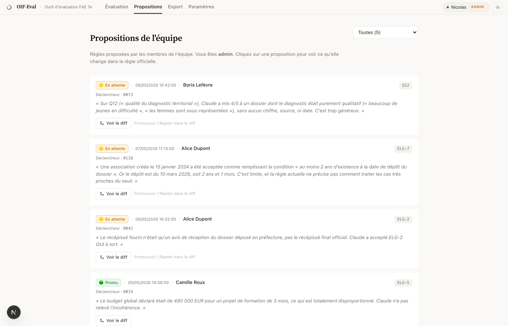

**Comment faire**

- Le sélecteur en haut à droite filtre par statut : En attente (jaune), Promues (vert), Rejetées (rouge), ou Toutes.
- Chaque proposition affiche l'auteur, le critère affecté, le dossier déclencheur et la raison.
- Cliquer sur "Voir le diff" pour examiner précisément ce que la proposition changerait dans la règle officielle.

### 5.2 Examiner et décider via le diff

Le modal Diff montre la règle avant et après promotion, en deux colonnes :

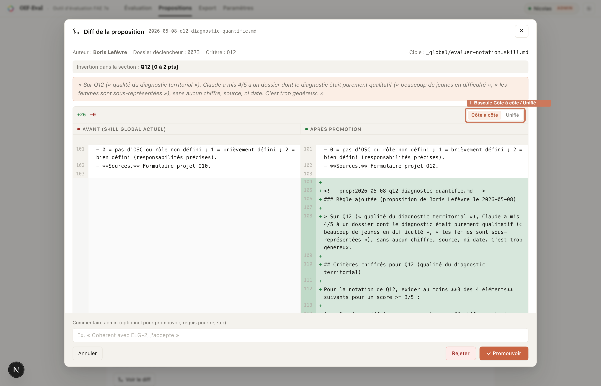

L'encadré en haut à droite permet de basculer entre la vue "Côte à côte" (deux colonnes, plus visuel) et la vue "Unifié" (une seule colonne avec marqueurs +/-).

**Comment faire (admin uniquement)**

- Lire le diff. Les ajouts apparaissent en vert, les suppressions en rouge.
- Saisir un commentaire admin (optionnel pour promouvoir, obligatoire pour rejeter).
- Cliquer "✓ Promouvoir" pour intégrer la règle au skill officiel. Tous les évaluateurs en bénéficient au prochain dossier.
- Cliquer "Rejeter" si la proposition n'est pas pertinente.
- Si une règle promue s'avère inadaptée, le bouton "Annuler la promotion" la retire (snapshot pris avant promotion).

---

## 6. Dashboard - suivi de l'équipe (admin)

L'onglet **Dashboard**, accessible dans la barre de navigation en haut (uniquement pour les admins), donne une vue d'ensemble de l'avancement de l'équipe : combien de dossiers sont traités, par qui, et où en est chaque évaluateur.

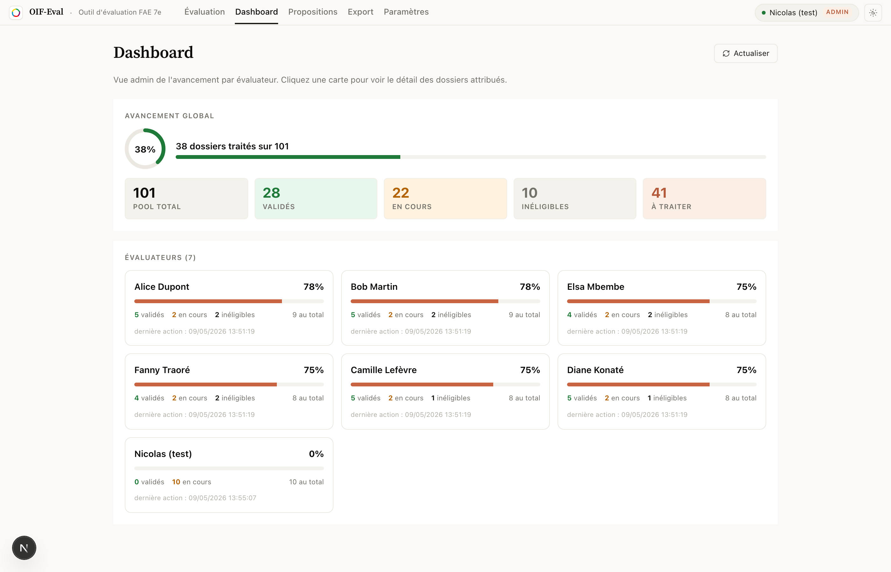

### 6.1 Avancement global

En haut de la page, une jauge circulaire affiche le pourcentage global de dossiers traités (validés + inéligibles) sur le pool total. Cinq tuiles complètent la vue :

- **Pool total** : nombre de dossiers candidats à évaluer.
- **Validés** : dossiers dont la review humaine est signée.
- **En cours** : dossiers ouverts par un évaluateur, pas encore validés.
- **Inéligibles** : dossiers écartés à la phase d'éligibilité.
- **À traiter** : dossiers du pool jamais ouverts.

### 6.2 Avancement par évaluateur

En dessous, une grille de cartes affiche un évaluateur par carte, triés par pourcentage d'avancement décroissant. Chaque carte montre :

- Le nom de l'évaluateur.
- Son **pourcentage personnel** : `(validés + inéligibles) / dossiers qu'il a touchés`.
- Une barre de progression colorée.
- Le détail : combien de validés, en cours, inéligibles, total.
- La date de la dernière action.

### 6.3 Détail d'un évaluateur

Cliquer sur une carte ouvre un panneau détaillé avec la liste de tous les dossiers attribués à cet évaluateur :

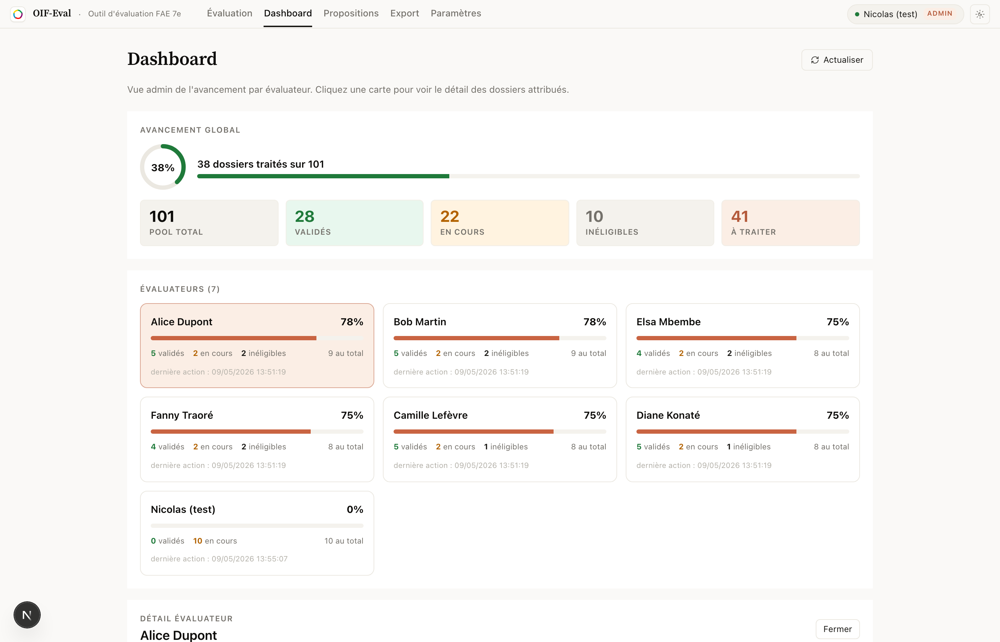

Les dossiers sont triés par actionabilité (en cours en premier, validés à la fin). Chaque ligne affiche l'identifiant du dossier, son statut (Validé / En cours / Inéligible / À traiter) et la date de la dernière action.

**Cliquer sur une ligne ouvre directement la fiche d'évaluation** du dossier dans la page Évaluation, pour examiner ou compléter le travail.

**Comment faire (admin uniquement)**

- Aller sur l'onglet Dashboard dans la barre de navigation.
- Le bouton "Actualiser" en haut à droite recharge les statistiques (utile après un import de pack ou un batch d'évaluations).
- Cliquer une carte évaluateur pour voir ses dossiers ; cliquer un dossier pour l'ouvrir.

---

## 7. Paramètres

La page Paramètres regroupe toutes les options de l'application, organisées en **onglets** (en haut de la page) :

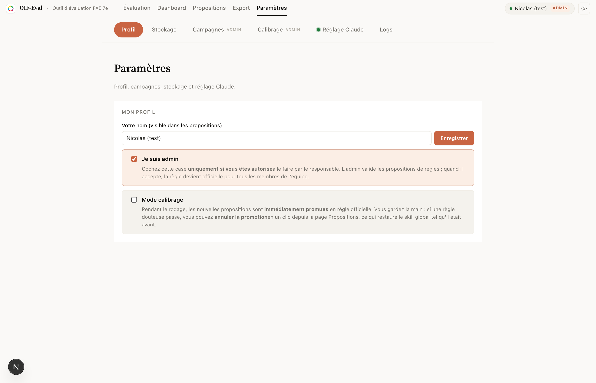

| Onglet | Contenu | Visibilité |
|--------|---------|------------|
| **Profil** | Votre nom, mode admin, mode calibrage. | Tous |
| **Stockage** | Mode de partage, dossier partagé, emplacements détaillés. | Tous |
| **Campagnes** | Liste des campagnes, création, activation, export ZIP. | Admin |
| **Calibrage** | Rapports de calibrage et génération de propositions. | Admin |
| **Réglage Claude** | Choix du modèle Claude, statut de connexion, test. | Tous |
| **Journal RGPD** | Journal d'audit complet et vérification d'intégrité. | Admin |

### 7.1 Onglet Profil

- **Votre nom** : visible dans les propositions de règles et dans l'audit log. À renseigner avant de commencer.
- **Je suis admin** : à cocher uniquement si autorisé par le responsable. L'admin peut promouvoir des règles, gérer les campagnes et accéder aux onglets sensibles.
- **Mode calibrage** (admin) : active la promotion automatique immédiate des nouvelles propositions, avec annulation possible en un clic. Utile pendant la phase de rodage.

### 7.2 Onglet Réglage Claude

L'onglet Réglage Claude regroupe le choix du modèle et le diagnostic de connexion :

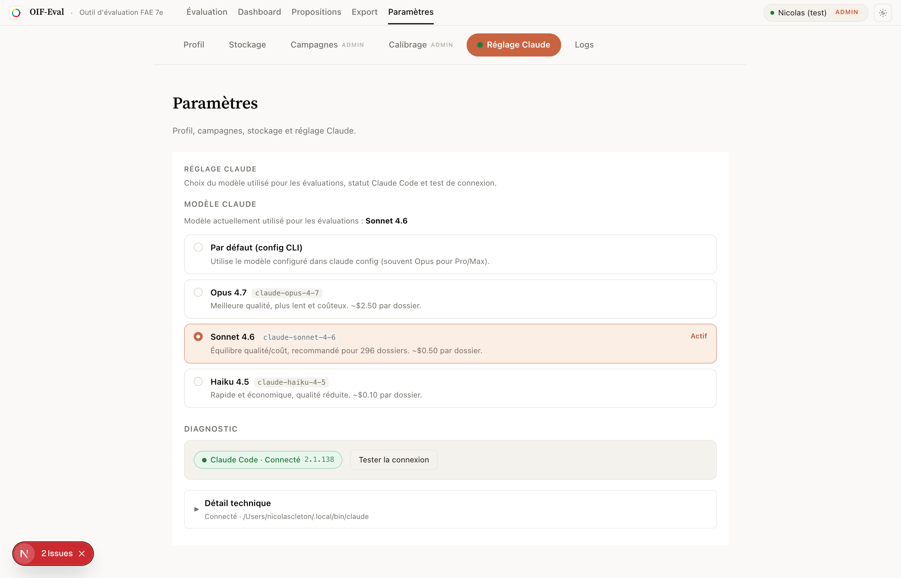

Une **pastille de statut** sur l'onglet (verte ou rouge) indique en un coup d'œil si Claude Code est connecté, sans avoir à ouvrir l'onglet.

- **Modèle Claude** : trois options (Opus 4.7, Sonnet 4.6, Haiku 4.5) avec leur coût indicatif par dossier. Par défaut, Sonnet 4.6 (équilibré).
- **Diagnostic** : statut Claude Code, version, chemin local, bouton "Tester la connexion" pour lancer un mini run de vérification.

---

## 8. Stockage et partage entre évaluateurs

L'onglet Stockage est le plus important à configurer correctement. Il définit **comment l'équipe partage les skills, les évaluations et le journal d'audit**.

### 8.1 Choisir un mode de partage

En haut de l'onglet, un sélecteur propose deux modes :

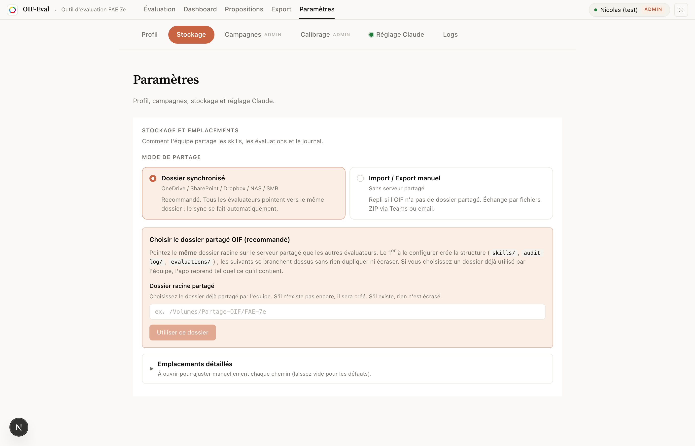

#### Mode 1 - Dossier synchronisé (recommandé)

Tous les évaluateurs pointent vers **le même dossier** sur un service de synchronisation (OneDrive Business, SharePoint Online, Dropbox, NAS d'entreprise, partage SMB). Le service de sync se charge de propager les fichiers entre les postes.

L'application **détecte automatiquement** le type de stockage à partir du chemin choisi :

- ☁ **OneDrive Business** : `~/Library/CloudStorage/OneDrive-OIF/...` (Mac) ou `%USERPROFILE%\OneDrive - OIF\...` (Windows).
- ☁ **SharePoint Online** : `~/Library/CloudStorage/SharePoint-OIF/...`.
- ☁ **Dropbox**, **Google Drive**, **iCloud** : détectés également.
- **Partage réseau (SMB)** : `\\serveur\partage` (Windows) ou volume monté `/Volumes/<nom>` (Mac).
- 📁 **Dossier local** : aucun partage, vos collègues ne verront pas son contenu (sauf via mode manuel).

Un **badge de couleur** s'affiche pour confirmer le type, et l'application **vérifie que le service de synchronisation tourne** sur le poste (badge vert ✓ ou rouge ✗). Si le sync engine n'est pas lancé, un avertissement vous prévient que vos modifications ne seront pas propagées.

**Recommandé pour OIF** : OneDrive Business ou SharePoint Online (compatible avec l'environnement Microsoft 365 de l'OIF).

#### Mode 2 - Import / Export manuel

Si aucun dossier partagé n'est disponible, le mode autonome permet d'échanger les données via des **fichiers ZIP** transmis par Teams, email ou clé USB :

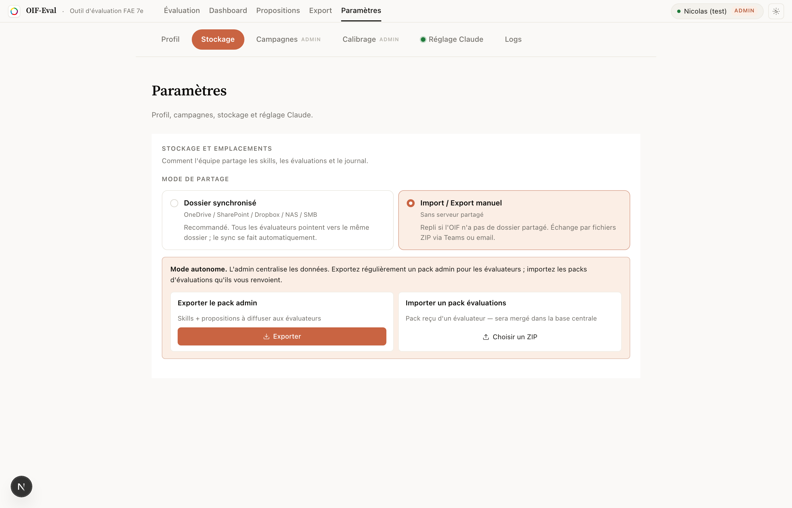

Le workflow est en étoile, l'admin centralise :

1. **L'admin** exporte un **pack admin** contenant les skills (règles d'évaluation) et les propositions de la campagne active.
2. Ce pack est diffusé aux 8 évaluateurs (Teams, email).
3. Chaque évaluateur **importe le pack admin** au démarrage de sa session : ses skills locaux sont mis à jour.
4. À la fin de la journée, l'évaluateur **exporte ses évaluations** finalisées en ZIP.
5. Le pack évaluations est renvoyé à l'admin.
6. **L'admin importe** chaque pack reçu : les évaluations sont mergées dans la base centrale.

Les ZIP sont signés par hash SHA-256 par fichier (corruption détectée à l'import).

### 8.2 Configurer le dossier partagé

Une fois le mode "Dossier synchronisé" choisi, indiquer le **dossier racine** que tous les évaluateurs partageront. L'application crée automatiquement la sous-structure (`skills/`, `audit-log/`, `evaluations/`).

**Important** :

- Le **premier** évaluateur à configurer ce dossier crée la structure.
- Les **suivants** se branchent sur la structure existante : aucun dossier n'est dupliqué, rien n'est écrasé.
- Si vous choisissez un dossier déjà utilisé par l'équipe, l'application reprend tel quel ce qu'il contient.

Le bloc "Emplacements détaillés" (collapsable) permet d'ajuster manuellement chaque chemin (candidatures, évaluations, skills, journal) si besoin.

### 8.3 Conflits de synchronisation

Si deux évaluateurs modifient le même fichier au même moment, certains services (OneDrive, Dropbox) créent un fichier "conflict copy". L'application détecte ces fichiers et affiche un **bandeau orange en haut de toutes les pages** :

> ⚠ 2 fichiers en conflit dans le dossier partagé. Cliquer pour résoudre.

Cliquer ouvre une modale qui liste les fichiers concernés. Comparer les versions, garder la bonne, supprimer le doublon (sans supprimer le fichier original sans le suffixe « conflicted copy »).

---

## 9. Gestion des campagnes (admin)

Une campagne correspond à une grille d'évaluation pour une édition (FAE 7e, FAE 8e, etc.). Une seule campagne est active à la fois. Les autres restent disponibles en archive.

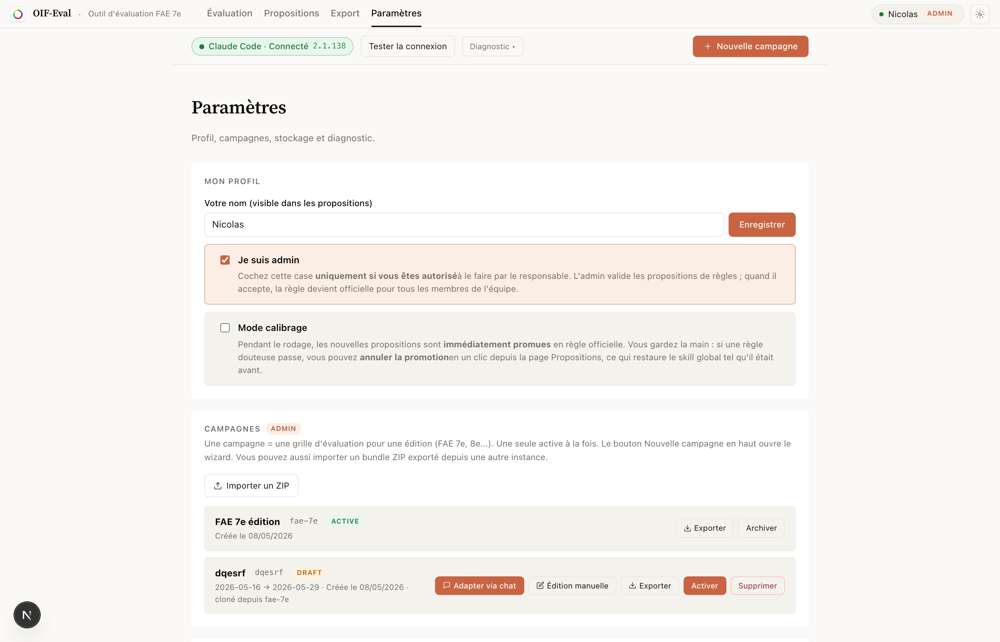

**Comment faire (admin uniquement)**

- Cliquer "Nouvelle campagne" en haut de page pour ouvrir l'assistant. Vous pouvez partir d'une campagne vide, copier une campagne existante, ou créer à partir d'un référentiel (PDF, Word, Markdown).
- "Importer un ZIP" : importer un bundle exporté depuis une autre instance OIF-Eval.
- Pour chaque campagne listée, vous pouvez : Activer (la mettre en service, l'ancienne est archivée), Archiver, Exporter en ZIP, Édition manuelle des skills.
- Les badges indiquent le statut : Active (vert), Brouillon (orange), Archivée (gris).

---

## 10. Calibrage et amélioration des règles (admin)

Le **calibrage** est le mécanisme qui permet à l'équipe de mesurer la qualité des règles d'évaluation IA et de les corriger là où Claude se trompe systématiquement. C'est l'outil clé pour rodage de la grille avant le démarrage d'une campagne.

### 10.1 Principe

Le calibrage compare les évaluations produites par Claude à des **notes humaines de référence** (par exemple les notes manuelles de l'édition précédente FAE 6e, ou un échantillon validé par un comité). Plus l'écart est faible, plus les règles sont fiables. Là où l'écart est important, l'admin peut générer des propositions correctives.

Le cycle de calibrage se déroule en quatre étapes :

1. **Importer une référence humaine** (notes manuelles existantes).
2. **Lancer Claude** sur les mêmes dossiers avec la grille actuelle.
3. **Lire le rapport de calibrage** : où Claude diverge-t-il, sur quels critères.
4. **Générer des propositions de règles** correctives, les promouvoir dans la grille officielle.

### 10.2 Liste des rapports de calibrage

L'onglet Calibrage affiche les rapports déjà produits :

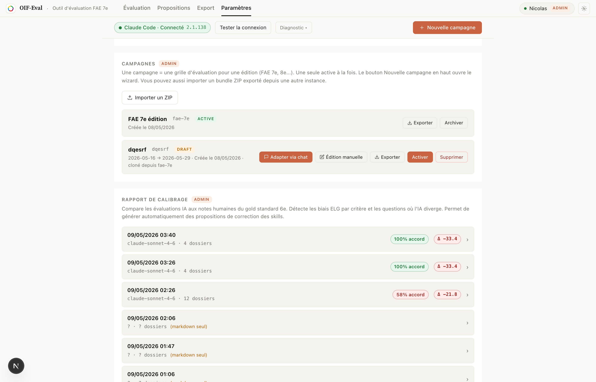

Chaque rapport affiche :

- La date et le modèle Claude utilisé.
- Le nombre de dossiers comparés.
- Le **pourcentage d'accord** sur les verdicts d'éligibilité (vert si ≥ 85%, orange entre 60 et 85%, rouge sinon).
- L'**écart de score moyen** (Δ) entre Claude et l'humain (vert si <5 pts, orange si <15 pts, rouge sinon).

**Comment faire (admin uniquement)**

- Cliquer sur un rapport pour ouvrir son détail.
- Le rapport le plus récent apparaît en haut de la liste.

### 10.3 Détail d'un rapport et génération de propositions

L'ouverture d'un rapport affiche un tableau de bord avec 4 indicateurs clés et le détail des biais critère par critère :

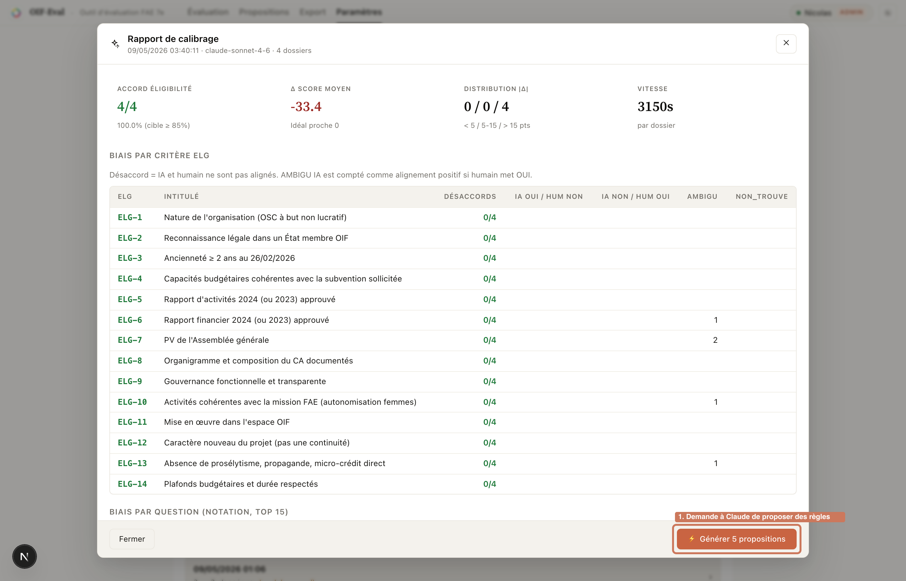

Les **stat cards** en haut résument :

- **Accord éligibilité** : combien de fois Claude et l'humain ont rendu le même verdict ÉLIGIBLE / INÉLIGIBLE.
- **Écart de score** : différence moyenne entre la note IA et la note humaine.
- **Distribution des écarts** : combien de dossiers à <5 pts d'écart, entre 5 et 15, >15.
- **Vitesse moyenne** par dossier.

Le tableau **"Biais par critère ELG"** montre, ligne par ligne, où Claude diverge des notes humaines : par exemple, sur le critère ELG-3 (ancienneté), combien de fois Claude a dit OUI alors que l'humain disait NON, ou inversement. C'est le diagnostic ligne à ligne.

Le bouton encadré en bas à droite, **"⚡ Générer 5 propositions"**, lance Claude en mode "amélioration" sur le rapport. Claude analyse les biais détectés et propose jusqu'à 5 règles d'amélioration concrètes (formulées dans le langage des skills officiels). Vous arbitrerez ensuite chaque proposition une par une via le diff visuel (section 5).

**Comment faire (admin uniquement)**

- Examiner les indicateurs et le tableau "Biais par critère" pour identifier les critères problématiques.
- Cliquer "⚡ Générer 5 propositions". Confirmer le run. Claude analyse le rapport et crée jusqu'à 5 propositions dans la file d'attente.
- L'app redirige automatiquement vers la page Propositions à la fin du run, pour arbitrage immédiat.

### 10.4 Bonnes pratiques

- Lancer un calibrage **avant** chaque nouvelle édition (FAE 8e, 9e), sur un échantillon de l'édition précédente.
- Activer le **mode calibrage** dans Profil pendant cette phase : les propositions promues sont immédiates, vous pouvez annuler en un clic si elles ne tiennent pas.
- Refaire un calibrage après chaque batch significatif de promotions, pour mesurer le gain.
- Viser ≥ 90% d'accord d'éligibilité et < 5 pts d'écart de score moyen avant de lancer la campagne en production.

---

## 11. Conformité et journal d'audit (admin)

OIF-Eval enregistre automatiquement toutes les actions sensibles (lancement d'évaluation, lecture de fichier candidat, validation de review, promotion de règle, modification de configuration, export de pack ZIP, etc.) dans un journal sécurisé.

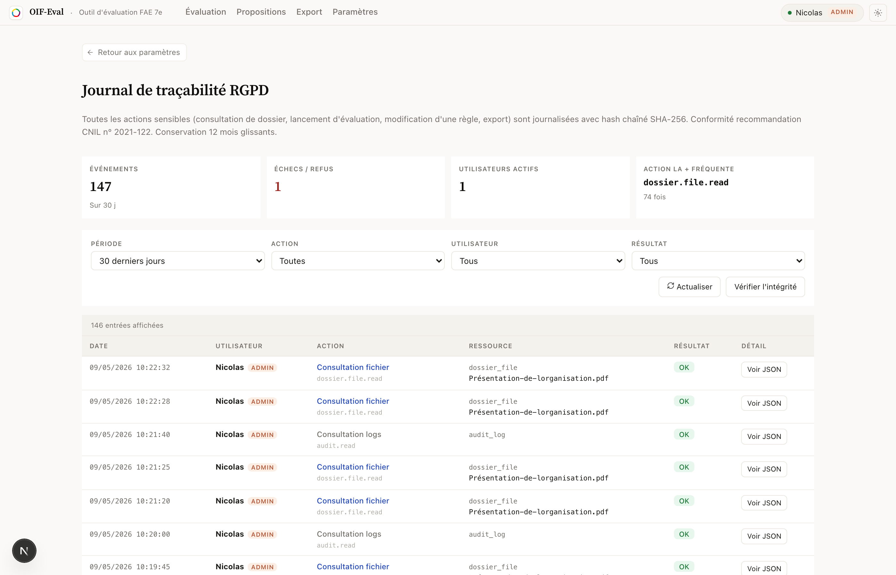

Le journal est organisé en un fichier par utilisateur par jour (`audit-log/<utilisateur>/<date>.jsonl`), chaque fichier protégé par un hash chaîné SHA-256 (toute modification rétroactive est détectable). Cette architecture évite les conflits d'écriture concurrents quand plusieurs évaluateurs travaillent simultanément sur le même dossier partagé.

**Comment faire (admin uniquement)**

- Filtrer par utilisateur, par action, ou par plage de dates.
- Cliquer sur un événement pour voir son détail JSON brut.
- Cliquer "Vérifier l'intégrité" pour confirmer que le journal n'a pas été altéré.
- Les statistiques en haut donnent une vue rapide : volume total, top actions, top utilisateurs, taux d'échecs.

L'OIF étant une organisation internationale, le RGPD au sens strict ne s'applique pas. Le journal sert ici à la **traçabilité interne** et à la transparence du travail d'évaluation : qui a fait quoi, quand, sur quel dossier.

---

## 12. Aide et support

### Si l'évaluation ne se lance pas

1. Vérifier en haut de Paramètres que le statut Claude Code est vert.
2. Cliquer "Tester la connexion" pour confirmer que Claude répond.
3. Si rouge, ouvrir un terminal et exécuter `claude login` pour vous reconnecter.

### Si Claude se trompe régulièrement sur un point

C'est normal en début de campagne, l'IA s'améliore au fil des dossiers grâce à vos corrections. Trois leviers :

1. Modifier la note via le bouton Modifier de la grille (correction ponctuelle).
2. Cliquer "Signaler un problème" pour proposer une règle (correction durable).
3. L'admin examine la proposition et la promeut si elle est pertinente. Tous les évaluateurs travaillent ensuite avec la règle améliorée.

### Si une règle promue cause des problèmes

L'admin peut annuler une promotion : dans Propositions, filtrer "Promues", ouvrir le diff, cliquer "Annuler la promotion". Le skill officiel revient à son état précédent.

### Sauvegarde des données

Toutes les évaluations, propositions et règles sont stockées localement dans le dossier configuré au premier lancement. Pensez à sauvegarder ce dossier régulièrement (Time Machine, OneDrive, etc.).

### Contact

Pour toute question d'utilisation, bug ou demande d'évolution, écrire à Nicolas Cléton (Petitmaker) : **nicolas.cleton@petitmaker.fr**.

---

*Guide mis à jour pour OIF-Eval v1 - mai 2026*
